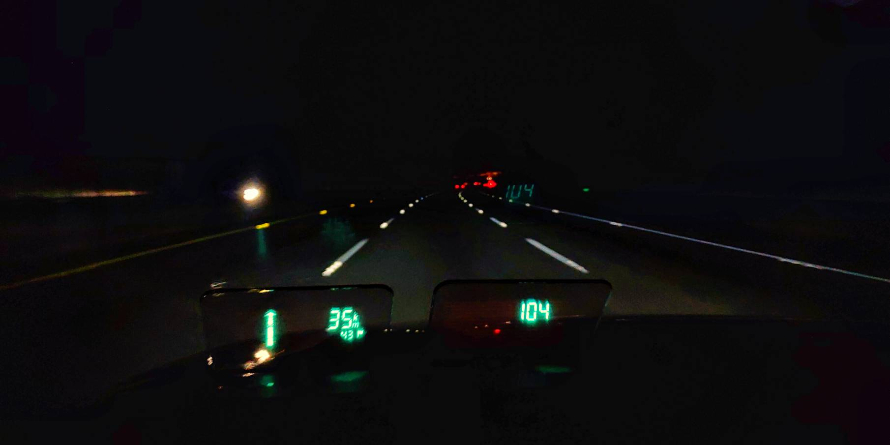
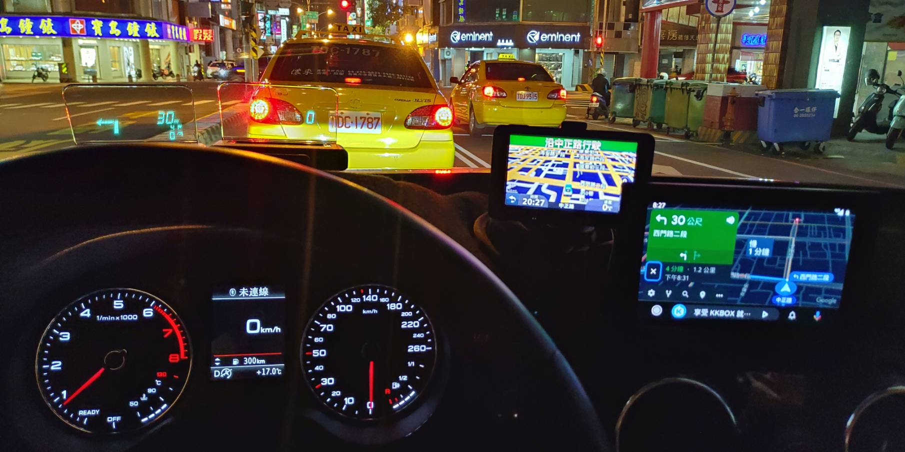
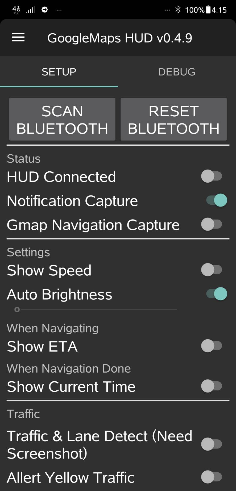

# Garminuino
There has two sub-project use GarminHUD as:
1. an app, Google Map HUD  (Android App+GarminHUD).  
 * [Downloading newest release App here.](https://github.com/skyforcetw/Garminuino/releases)
 * [Further Information for Android App.](https://github.com/skyforcetw/Garminuino/blob/master/GoogleMaps_HUD/README.md)  
   * [Install.](https://github.com/skyforcetw/Garminuino/blob/master/GoogleMaps_HUD/INSTALL.md)  
   * [First Use.](https://github.com/skyforcetw/Garminuino/blob/master/GoogleMaps_HUD/FIRST_USE.md)  
   * [Instruction.](https://github.com/skyforcetw/Garminuino/blob/master/GoogleMaps_HUD/INSTRUCTIONv052.md)  
 * [Android Auto Cooperation.](https://github.com/skyforcetw/Garminuino/blob/master/GoogleMaps_HUD/AndroidAuto.md)
 
 * Newest App Release
   * [2021-08-20 v0.8.6](https://github.com/skyforcetw/Garminuino/files/7016037/gmaps_hud-release_v0.8.6.zip)
Fix Arrow v2 at android 6.0.  
   * [2020-09-29 v0.8.3](https://github.com/skyforcetw/Garminuino/releases/download/0.8.3/gmaps_hud-release_v0.8.3.apk)
Change Arrow SAD calculation.
   * [Release History](https://github.com/skyforcetw/Garminuino/blob/master/ReleaseHistory.md)

 
2. a speedometer HUD  (Arduino+GarminHUD, STOP MAINTAIN)

***
Known Issue:
* The app will crash after booting on some device (ESPECIALLY ON ANDROID 6.0), then nofication capture will un-work. 
There has no solution for this bug now. If you encounter this issue, please follow step below to resolve (sometimes works) :
  1. Uninstall the app
  2. rebooting
  3. Install the app after booting. 

***

Belows are two sub-proejct put together: GoogleMap navigation HUD(Left)+ Speedometer HUD(Center)

Belows are two sub-proejct & Android Auto put together:  
GoogleMap navigation HUD(Left1)+ Speedometer HUD(Left2) + Android auto(Right1) 

Android App: Google Map HUD

***

## ToDo List
1. ~~Add auto-connection function.~~
2. Auto lanunch google map when HUD connected.
3. ~~Comment source-code.
4. ~~Show some usage infomation when navigation is done, don't make it seems hang when navigating done.~~
5. ~~Figure out auto connection is working well or not.~~
6. ~~Lets "Show Speed" function working well.~~
7. ~~Better auto-connection with GarminHUD
8. ~~Support Sygic & OsmAnd (GIVE UP! Cause of bad text recongnition).
9. Support Android Q's screen capture.
10. Improve arrow recognition.

***

## Authors

* **skyforce Shen** - *Initial work* - [github](https://github.com/skyforcetw) skyforce@gmail.com

## Contributor
* **Gabriel Valky** / **Frank Huebenthal** - *garmin hud protocol research* - [github](https://github.com/gabonator/Work-in-progress/tree/master/GarminHud) 

* **Niklas04** - help improve parsing & add German language support
[github](https://github.com/Niklas04) 

* **intervigilium** - add support for BMW HUD 
[github](https://github.com/intervigilium) 

* **Android-BluetoothSPPLibrary** - Bluetooth SPP Library, use to link Garmin HUD.
[github](https://github.com/akexorcist/Android-BluetoothSPPLibrary) 

* ~~**Android-BluetoothSPPLibrary** - Bluetooth SPP Library also, which fixed issue of auto connection.
[github](https://github.com/naevtamarkus/Android-BluetoothSPPLibrary)~~

***
### Folder Structure
    .
    ├── GoogleMap_Arrow_Recognize   # Arrow Recognize Experimental Project for Visual Studio C++
    ├── GoogleMaps_HUD              # Pure Android App based Google Maps HUD
    ├── navigation HUD              # Arduino based Googoogle Maps HUD (deprecated)
    ├── pics                        # Some pictures for README usage
    └── speedometer HUD             # Arduino based Speedmeter with Garmin HUD
***

Hence the information below is not necessary anymore, but I still keep it for commemorative.

This is the inital concept of Garminuino, but the implment is slight difference to the concept. For example, Garmin Hud is not linked by BLE, so BLE moduble is needless.

## [Speedometer HUD](https://github.com/skyforcetw/Garminuino/tree/master/speedometer%20HUD)

(click image can link to Youtube film)

A OBD/CanBus parser by Arduino, and a speed info transmitter by bluetooth(to GarminHUD) .

## [navigation HUD](https://github.com/skyforcetw/Garminuino/tree/master/navigation%20HUD)      (deprecated now!)

(click image can link to Youtube film)

Besides parts of Speedometer HUD, a USB Host Shield with a Android mobile phone can fetch Google Navigation info, and transmit info by bluetooth to GarminHUD, too.

***

